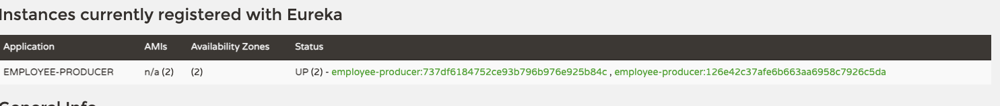

# spring-cloud-learn

from [javinuse.com](https://www.javainuse.com/spring/)

## Eureka Instance Id 설정 국룰

> instance id 가 겹치지 않아야 Eureka에서 다른 Replica 로 구별 할 수 있다.

```yml
spring.application.name: employee-producer

eureka:
  instance:
    instanceId: ${spring.application.name}:${vcap.application.instance_id:${spring.application.instance_id:${random.value}}}
```



[see more](https://cloud.spring.io/spring-cloud-netflix/multi/multi__service_discovery_eureka_clients.html#_changing_the_eureka_instance_id)

## Ribbon을 이용해서 LoadBalancer 설정하기

### Ribbon 의존성 추가

* Spring Cloud Starter Ribbon (deprecated, please use spring-cloud-starter-netflix-ribbon)

```xml
<!-- Ribbon -->
<dependency>
  <groupId>org.springframework.cloud</groupId>
  <artifactId>spring-cloud-starter-netflix-ribbon</artifactId>
  <version>2.2.10.RELEASE</version>
</dependency>
```

### RestTemplate Bean으로 만든 후, LoadBalencer 어노테이션 추가

```java
@LoadBalanced
@Bean
RestTemplate getRestTemplate() {
  return new RestTemplate();
}
```